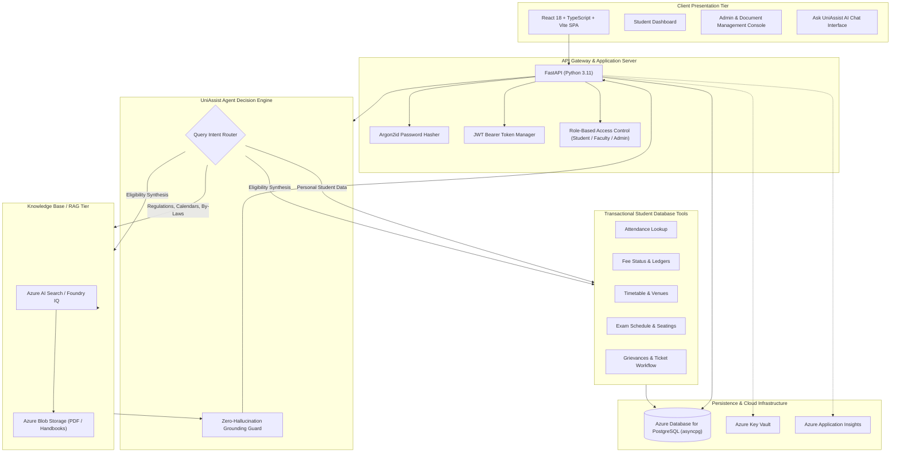

# UniAssist AI — University Student Support AI Agent Platform

[](https://python.org)
[](https://fastapi.tiangolo.com)
[](https://react.dev)
[](https://www.typescriptlang.org)
[](https://tailwindcss.com)
[](https://www.postgresql.org)
[](https://azure.microsoft.com)

**UniAssist AI** is a production-grade, enterprise university student support platform designed for real-world academic institutions and cloud deployment on Microsoft Azure. It unites grounded retrieval-augmented generation (Azure AI Search / Foundry IQ) with authenticated transactional student tools (attendance, fee status, timetables, examinations, and grievance management) under a zero-hallucination guarantee.

---

## 1. System Architecture



---

## 2. Core Capabilities

1. **UniAssist Student Support Agent:** Natural language academic assistant answering questions with verifiable citations from university handbooks and policies.
2. **Strict Zero-Hallucination Guardrails:** If official policy documents do not substantiate a claim, UniAssist explicitly states the information cannot be found and directs the student to the relevant department.
3. **Personal Student Tools:**
   - Attendance tracking with 75% examination eligibility analysis.
   - Real-time tuition and hostel fee ledger balances.
   - Weekly lecture timetables and classroom allocations.
   - Mid-term and end-term examination seating datesheets.
   - Grievance and complaint filing with unique ticket IDs (`CMP-2026-00125`).
4. **Role-Based Access Control (RBAC):** `STUDENT`, `FACULTY`, and `ADMIN` roles enforced at the API layer. A student can **never** access another student's attendance, fees, timetable, exams, or complaints.
5. **Modern Argon2id Cryptography:** Industry-standard password hashing protecting against GPU and side-channel timing attacks.
6. **Cost-Optimized Cloud Footprint:** Tailored for student subscriptions (~$9,555 credits), preventing accidental overspend via pay-as-you-go metering and auto-scaling to zero instances.

---

## 3. Technology Stack

| Layer | Technologies |
| :--- | :--- |
| **Frontend** | React 18, TypeScript, Vite, Tailwind CSS, Lucide Icons, React Router v6 |
| **Backend** | Python 3.11, FastAPI, Pydantic v2, SQLAlchemy 2.0 (async-first with `asyncpg`) |
| **Database** | PostgreSQL 16 (production), `aiosqlite` (lightweight offline testing) |
| **AI / Cloud** | Microsoft Azure AI Foundry, Azure OpenAI (`gpt-4o-mini`, `text-embedding-3-small`), Azure AI Search (Foundry IQ), Azure Blob Storage, Azure Key Vault, Azure Monitor / App Insights |
| **Containerization** | Docker, multi-stage builds, Docker Compose, Azure Container Apps |

---

## 4. Prerequisites

- **Node.js:** v18+ (tested on Node v24.19.0 LTS)
- **Python:** 3.11+ (managed via `uv` or system Python)
- **Git:** 2.40+
- **Docker & Docker Compose:** (Optional for containerized local development)

---

## 5. Local Quickstart

### Step 1: Clone and Configure Environment
```bash
# Clone the repository
git clone <repository-url>
cd uniassist-ai

# Copy environment variables template
cp .env.example .env
```

### Step 2: Backend Setup
```bash
cd backend

# Create virtual environment and activate
python -m venv .venv

# On Windows (PowerShell):
.venv\Scripts\Activate.ps1
# On macOS / Linux:
source .venv/bin/activate

# Install dependencies
pip install -r requirements.txt

# Run automated tests
pytest tests -v

# Start FastAPI development server
uvicorn app.main:app --reload --port 8000
```
API Documentation will be live at:
- **Swagger UI:** `http://localhost:8000/docs`
- **Health Probe:** `http://localhost:8000/api/v1/health`

### Step 3: Frontend Setup
```bash
cd ../frontend

# Install dependencies
npm install

# Run production build check
npm run build

# Start Vite development server
npm run dev
```
Frontend web portal will be accessible at: `http://localhost:5173`

---

## 6. Demo Accounts

| Role | Email | Password | Access Area |
| :--- | :--- | :--- | :--- |
| **Student** | `student@example.com` | `StudentPassword123!` | `/student/dashboard` |
| **Faculty** | `faculty@example.com` | `FacultyPassword123!` | Academic Grading & Schedules |
| **Administrator** | `admin@example.com` | `AdminPassword123!` | `/admin/dashboard` |

*(Quick switch buttons are available on the login screen for testing convenience).*

---

## 7. Automated Test Verification

UniAssist AI includes automated backend pytest suites testing:
- Argon2id password hashing and verification.
- Student account registration and duplicate email protection.
- JWT bearer token authentication and expiration.
- Cross-role authorization and RBAC dependency guards.
- System health and database connectivity probes.

Run the test suite from the repository root:
```bash
python -m pytest backend/tests -v
```

---

## 8. Azure Cost Management

Please consult [`COST_MANAGEMENT.md`](COST_MANAGEMENT.md) for detailed guidelines on:
- Staying within the student subscription allocation.
- Selecting pay-as-you-go `gpt-4o-mini` instead of expensive Provisioned Throughput Units.
- Configuring Azure Container Apps to scale down to 0 replicas during idle periods.
- Setting automated budget alerts and daily telemetry caps.

---

## 9. Phase Roadmap

- [x] **Phase 1: Project Architecture & Foundations** (Current)
- [ ] **Phase 2: Database Schema & Authentication**
- [ ] **Phase 3: FastAPI Backend & Student Endpoints**
- [ ] **Phase 4: React Dashboards & Interactive UI**
- [ ] **Phase 5: Microsoft Foundry AI Agent Integration**
- [ ] **Phase 6: Azure AI Search / Foundry IQ RAG Pipeline**
- [ ] **Phase 7: Transactional Student Tool Calling**
- [ ] **Phase 8: Admin Document Management & Ingestion**
- [ ] **Phase 9: Analytics, Observability & Auditing**
- [ ] **Phase 10: Dockerization & Azure Container Apps Deployment**
