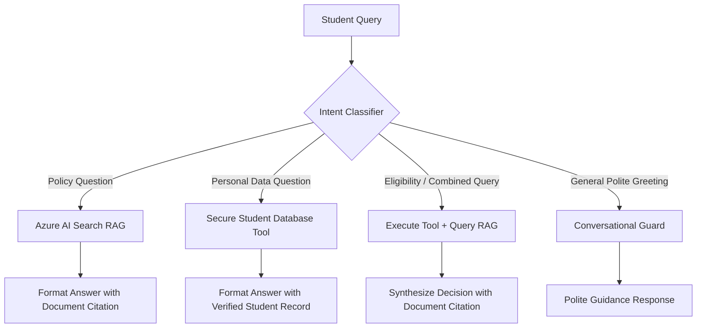
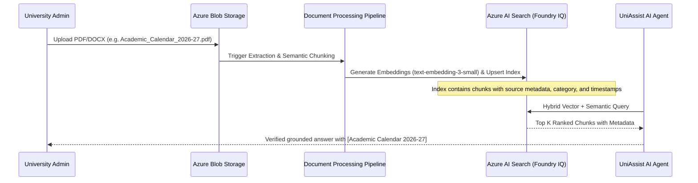

# UniAssist AI — Agentic AI & RAG Architecture

## 1. Core Principles

The UniAssist AI Agent operates under strict academic and privacy requirements:
1. **Zero Hallucination:** The agent must never invent regulations, policies, dates, fees, or personal records. If an answer cannot be grounded in official documents, it must explicitly state that information was not found and direct the student to the appropriate administrative office.
2. **Tool vs Knowledge Routing:**
   - **University Regulations/Policies:** Routed to Azure AI Search / Foundry IQ (e.g. attendance criteria, hostel rules, scholarship deadlines).
   - **Student Transactional Data:** Routed to secure database tools via authenticated student context (e.g. "What is my current attendance?").
   - **Hybrid Reasoning:** Synthesizes tool outputs with policy regulations (e.g. "Am I eligible for exams?" -> fetch student attendance: 82% -> fetch exam policy: 75% -> synthesize: Eligible -> cite Attendance By-Laws).
3. **Cross-Student Security Boundary:** Tools only receive the verified `student_id` extracted from the server-validated JWT session, never from user prompt text.

---

## 2. Decision Matrix

---

## 3. Azure AI Search / Foundry IQ Indexing Pipeline

