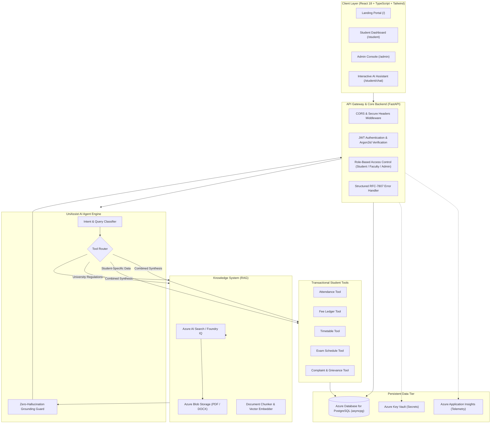

# UniAssist AI — System Architecture Specification

## 1. Architectural Vision

UniAssist AI is designed as a secure, production-grade university intelligence platform deployed on Microsoft Azure. It bridges the gap between unstructured academic knowledge (regulations, syllabi, hostel rules, fee policies) and structured transactional student data (attendance records, payment ledgers, exam schedules, grievances).

---

## 2. Component Architecture Diagram



---

## 3. Layer Breakdown

### 3.1 Frontend Tier (Client Layer)
- **Framework:** React 18 with TypeScript and Vite.
- **Styling:** Tailwind CSS with modern university SaaS design system (no generic colors; clean typography with Google Inter; responsive mobile drawer and desktop sidebar).
- **State & Communication:** React Context (`AuthContext`), strongly-typed API client (`ApiClient`), token-based authentication persistence.

### 3.2 Backend Tier (FastAPI Async-First)
- **Framework:** FastAPI 0.115+ with pure asynchronous SQLAlchemy 2.0.
- **Database Driver:** `asyncpg` for production PostgreSQL; optional `aiosqlite` for rapid offline testing.
- **Security:** Argon2id password hashing (`argon2-cffi`), signed HS256 JWT tokens with role claims, strict cross-student data boundary enforcement.
- **Standardized Error Envelope:**
  ```json
  {
    "success": false,
    "error": {
      "code": "RESOURCE_NOT_FOUND",
      "message": "The requested resource was not found."
    }
  }
  ```

### 3.3 AI & RAG Tier (Microsoft Azure)
- **Model Deployment:** Azure OpenAI `gpt-4o-mini` on standard token-metered pay-as-you-go pricing (protects student cloud budget).
- **Embeddings:** `text-embedding-3-small` (1536 dimensions).
- **Search & Retrieval:** Azure AI Search / Foundry IQ with hybrid search (dense vectors + BM25 keyword matching) and semantic reranking.
- **Citation Engine:** Strict source document tracking. The AI must cite official source files (`[Academic Calendar 2026-27]`) and refuse to speculate when confidence is low.
